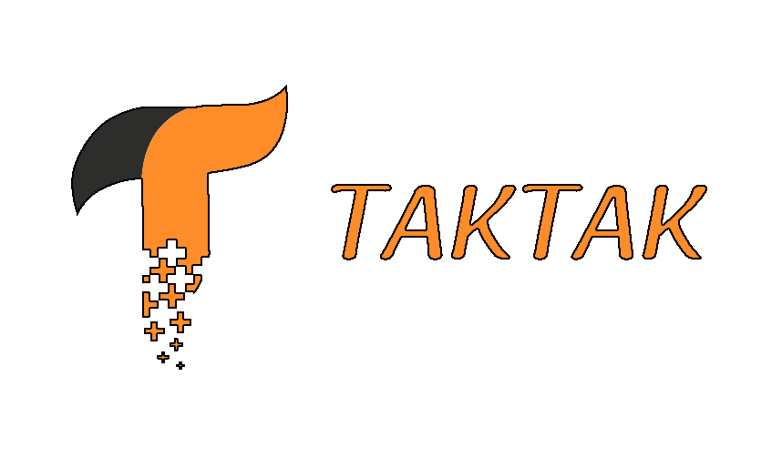

# **TAKTAK**

## Introduction

Taktak est un système développé dans le but de minimiser l’encombrement dans les espaces publics. Ceci est réalisé sur deux volés : un volé software qui consiste en une application mobile permettant l’accès aux données correspondant à l’espace envisagé et un volé hardware qui s’occupe de suivi de nombre de personne présent dans un tel espace et la transmission de ces données en temps réel.

## Vidéo de réalisation

https://www.youtube.com/watch?v=dyVGSOqn-tE

## Description

Ce système permet à son utilisateur de consulter le temps d’attente estimatif pour se servir dans l’espace destiné. Par conséquent, ce système aide à la gestion d’une ville smart contre l’encombrement tout en assurant une attente plus courte dans les espaces publics.

## Remerciment

Grand merci à l'**Association Robotique ENSI** et aux deux chers encadreurs **Hamza Ben Saoud** et **Siwar Belloumi**.
